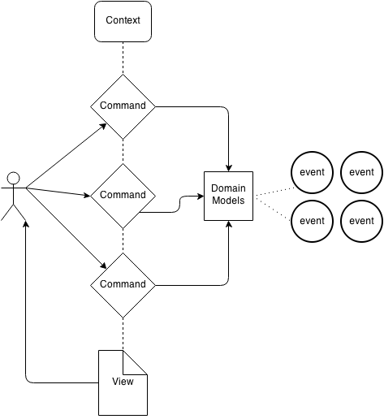

Dolmen
======

## What's that ?

Dolmen is a micro php library for building complient **CDMV** architecture. A
**CDMV** architecture means **Commands Domain Models View**.

## CDMV ... Wut ?

You should be aware of the famous MVC pattern that works with the most popular
frameworks under the web. Dolmen is a little try with something else. The MVC
most famous problem is the **C** (Controller) part. It can becames is very big mess !

So CDMV try to separate the **C** part into 2 differents concepts :

- Commands
- Domains

I think a pictures worth a billions words :

### Basic MVC

)

### CDMV

